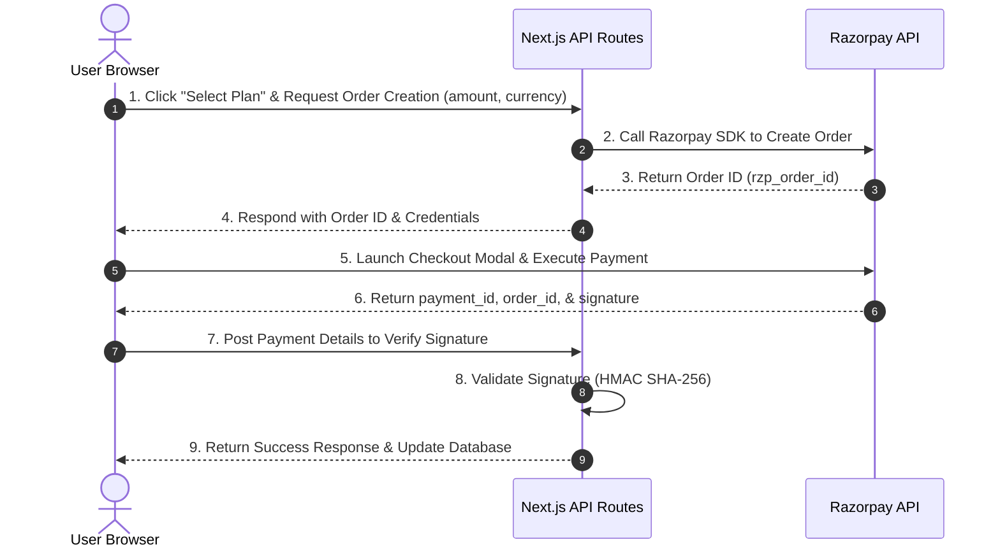

# Implementation Plan: Razorpay Payment Integration

This document outlines the design and integration plan for connecting the **Razorpay Payment Gateway** to your Next.js application. This setup allows users to securely purchase performance marketing plans directly from the website.

---

## Architecture Diagram



---

## Step-by-Step Integration Guide

### 1. Razorpay Account & Environment Setup
- Create an account on the [Razorpay Dashboard](https://dashboard.razorpay.com/).
- Switch to **Test Mode** (for development/testing) and go to **Settings > API Keys** to generate:
  - `Key ID`
  - `Key Secret`
- Add these credentials to your local configuration (`.env.local`):
  ```env
  NEXT_PUBLIC_RAZORPAY_KEY_ID=rzp_test_xxxxxxxxxxxxxx
  RAZORPAY_KEY_SECRET=xxxxxxxxxxxxxxxxxxxxxxxx
  ```
  > [!IMPORTANT]
  > Never expose `RAZORPAY_KEY_SECRET` in browser-accessible files or prefix it with `NEXT_PUBLIC_`. Keep it strictly on the server side.

---

### 2. Dependency Installation
Install the official Razorpay SDK to handle order creation on the server side:
```bash
npm install razorpay
```

---

### 3. Server-Side: Order Creation API Route
Create a new Next.js API route to initiate the transaction. This endpoint creates a secure order on Razorpay's servers.

#### [NEW] [route.js](file:///c:/CompanyProjects/AI-Powered-Digital-Marketings-main/app/api/razorpay/order/route.js)
```javascript
import { NextResponse } from "next/server";
import Razorpay from "razorpay";

const razorpay = new Razorpay({
  key_id: process.env.NEXT_PUBLIC_RAZORPAY_KEY_ID,
  key_secret: process.env.RAZORPAY_KEY_SECRET,
});

export async function POST(req) {
  try {
    const { amount, planName } = await req.json();

    // Razorpay accepts amounts in paise (e.g., ₹100 = 10000 paise)
    const options = {
      amount: amount * 100, 
      currency: "INR",
      receipt: `receipt_${Date.now()}`,
      notes: {
        planName,
      },
    };

    const order = await razorpay.orders.create(options);
    return NextResponse.json({ success: true, orderId: order.id, amount: order.amount });
  } catch (error) {
    console.error("Razorpay order error:", error);
    return NextResponse.json({ success: false, error: error.message }, { status: 500 });
  }
}
```

---

### 4. Client-Side Checkout Script & Event Handler
To load the Razorpay checkout overlay dynamically, import `next/script` in your pricing page or checkout popup.

#### [MODIFY] [page.jsx](file:///c:/CompanyProjects/AI-Powered-Digital-Marketings-main/app/pricing/page.jsx)
Include the external Razorpay script and implement the transaction flow:

```javascript
import Script from "next/script";

// Inside PricingPage component:
const makePayment = async (amount, planName) => {
  // 1. Create order on Next.js server
  const response = await fetch("/api/razorpay/order", {
    method: "POST",
    headers: { "Content-Type": "application/json" },
    body: JSON.stringify({ amount, planName }),
  });
  const data = await response.json();

  if (!data.success) {
    alert("Unable to initiate order. Please try again.");
    return;
  }

  // 2. Open Razorpay Checkout Modal
  const options = {
    key: process.env.NEXT_PUBLIC_RAZORPAY_KEY_ID,
    amount: data.amount,
    currency: "INR",
    name: "AI Digital",
    description: `Billing for ${planName}`,
    image: "/logo.png",
    order_id: data.orderId,
    handler: async function (response) {
      // 3. Send payment details to verification endpoint
      const verifyResponse = await fetch("/api/razorpay/verify", {
        method: "POST",
        headers: { "Content-Type": "application/json" },
        body: JSON.stringify({
          razorpay_order_id: response.razorpay_order_id,
          razorpay_payment_id: response.razorpay_payment_id,
          razorpay_signature: response.razorpay_signature,
        }),
      });
      const verifyData = await verifyResponse.json();
      if (verifyData.success) {
        alert("Payment Successful!");
        // Redirect to success page or refresh state
      } else {
        alert("Payment verification failed.");
      }
    },
    prefill: {
      name: "User Name",
      email: "user@example.com",
      contact: "9999999999",
    },
    theme: {
      color: "#E56030", // Harmony styling matching standard theme color
    },
  };

  const paymentObject = new window.Razorpay(options);
  paymentObject.open();
};
```
And add the checkout script at the bottom of the main layout:
```javascript
<Script src="https://checkout.razorpay.com/v1/checkout.js" strategy="lazyOnload" />
```

---

### 5. Server-Side: Signature Verification API Route
Verifying the signature prevents users from spoofing payment responses by generating checkout tokens manually.

#### [NEW] [route.js](file:///c:/CompanyProjects/AI-Powered-Digital-Marketings-main/app/api/razorpay/verify/route.js)
```javascript
import { NextResponse } from "next/server";
import crypto from "crypto";

export async function POST(req) {
  try {
    const { razorpay_order_id, razorpay_payment_id, razorpay_signature } = await req.json();

    // Re-create the verification signature using HMAC SHA-256
    const sign = razorpay_order_id + "|" + razorpay_payment_id;
    const expectedSign = crypto
      .createHmac("sha256", process.env.RAZORPAY_KEY_SECRET)
      .update(sign.toString())
      .digest("hex");

    if (razorpay_signature === expectedSign) {
      // Perform database state changes here (e.g. mark user invoice paid, send onboarding email)
      return NextResponse.json({ success: true, message: "Payment verified successfully" });
    } else {
      return NextResponse.json({ success: false, message: "Invalid signature" }, { status: 400 });
    }
  } catch (error) {
    console.error("Verification error:", error);
    return NextResponse.json({ success: false, error: error.message }, { status: 500 });
  }
}
```

---

## Verification Plan

### Manual Testing in Sandbox Mode
1. **Initialize Payment Flow**: Trigger a payment inside the Pricing Popup or Pricing Page.
2. **Checkout Validation**: Ensure the Razorpay modal overlays successfully with the custom theme color (`#E56030`) and details.
3. **Verify Test Cards**: Use Razorpay's [test payment details](https://razorpay.com/docs/payments/payments/test-card-details/) to trigger successful and failed payments.
4. **Signature Verification**: Confirm that the API route `/api/razorpay/verify` successfully handles client callbacks and signatures, outputting a verification confirmation response.
